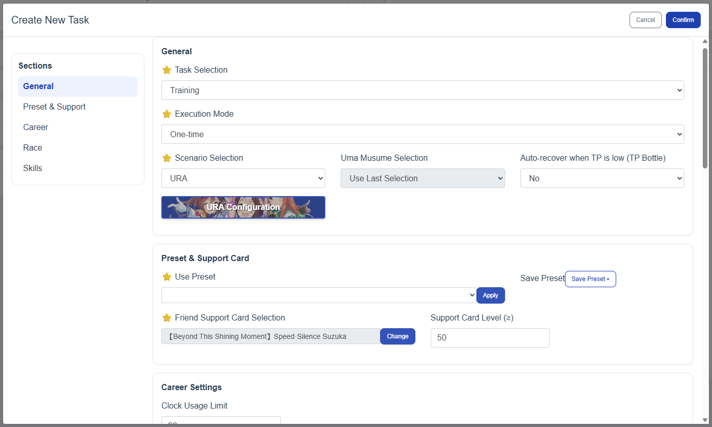
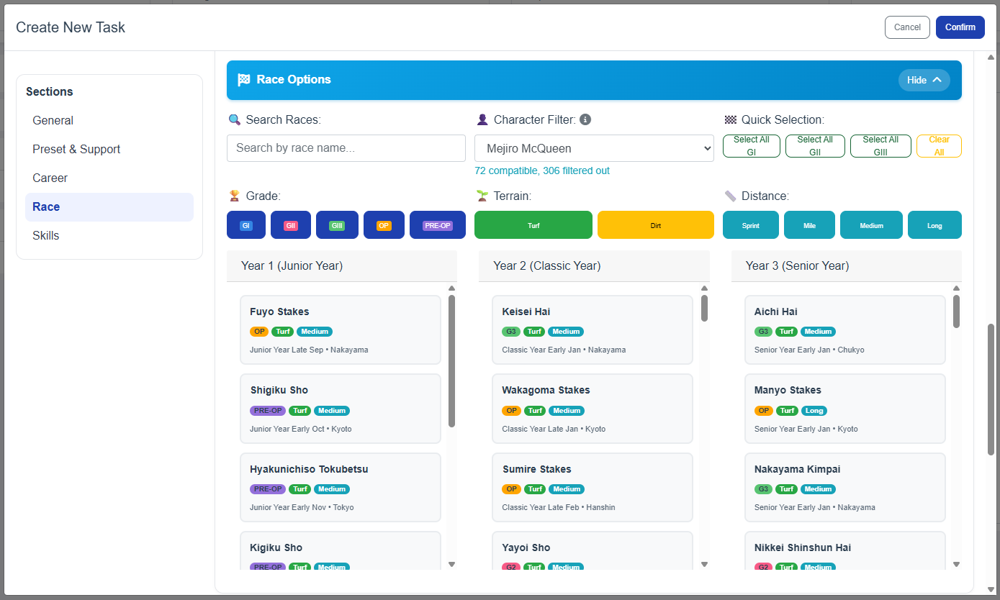
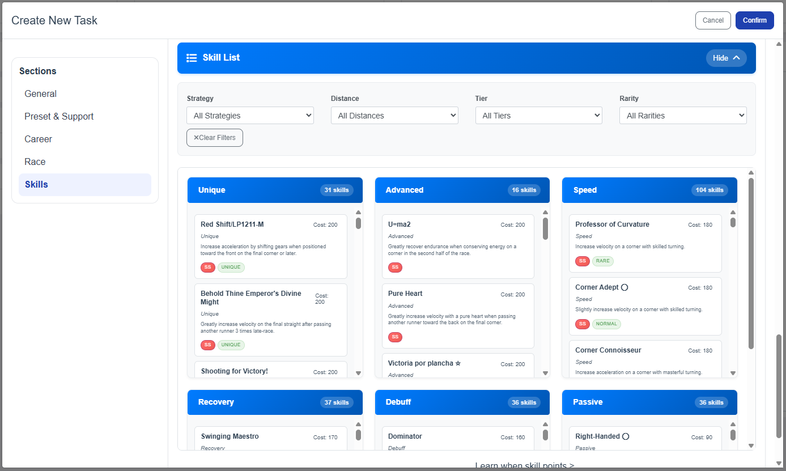

# 🏇 Umamusume Auto Trainer (Global Server Edition)

**Uma Musume Pretty Derby Global Server Automatic Career Tool**

> **From China server automation to global server compatibility** - A complete transformation with enhanced features, improved UI, and robust automation capabilities.
>
> ***This project is for educational purpose only, [use it at your own risk](https://umamusume.com/news/100029/)***


## 📄 **License & Credits**

This project is a **Global Server adaptation** of the original China Server version by [@shiokaze](https://github.com/shiokaze/UmamusumeAutoTrainer).

### **Original Project**
- **Original Author**: [@shiokaze](https://github.com/shiokaze/UmamusumeAutoTrainer)
- **Original Repository**: [UmamusumeAutoTrainer](https://github.com/shiokaze/UmamusumeAutoTrainer) (China Server)

### **This Project**
- **Global Server Adaptation**: [UAT-Global-Server](https://github.com/BrayAlter/UAT-Global-Server)
- **Based on**: Original China Server version
- **Enhancements**: 70% translation, improved UI, Global Server compatibility

**Please respect the original author's work while contributing improvements.**


---


## 🌟 **What's New in Global Server Edition**

### 🎯 **Major Improvements**
- **🌍 Global Server Migration**: 70% translation and asset updates for Global Server compatibility
- **🎨 Enhanced Web Interface**: Advanced race filtering, skill choice system, and improved user experience
- **🤖 Reliable Race Identification**: Dual verification (template + OCR) for accurate race ID detection
- **⚡ Performance Optimization**: JSON-based data loading for faster operation
- **📱 Smart Device Detection**: Automatic ADB device detection and selection when start the program (emulator must open the game first)

### 🆕 **New Features**
- **Advanced Race Filtering**: Filter by race type, distance, terrain, and event character
- **Skill Choice System**: Intelligent skill selection interface in web application
- **Event Choice Picker**: Smart event selection for optimal training
- **70% English Translation**: Major UI and system text translated to English
- **Auto Device Selection**: Interactive ADB device detection and selection
- **🎮 Manual Skill Purchase**: New feature allowing manual skill selection at the end of career while maintaining automatic skill learning during normal training
- **Preset Saving System (UAT Web)**: Save and load your preferred race filter settings instantly

### 🔄 **Current Limitations**
- **Uma Musume Selection**: Must be done manually in-game (not yet automated)
- **Support Card Selection**: Manual selection in-game required


## 🚀 **Features**

### **Core Automation**
- ✅ **Automatic Training**: Complete training scenarios for all Uma Musume
- ✅ **Customizable Targets**: Training attributes, racing tactics, additional races
- ✅ **Skill Learning**: Optimized skill acquisition for 3-star spark farming
- ✅ **Manual Skill Purchase**: Option to manually select skills at career end while keeping auto-learning during training
- ✅ **Inheritance Compatibility**: Improved training strategy support
- ✅ **Loop Training Bot Logic**: Continuous stat-growth training loop for long runs — see the 📹 [Video Tutorial](https://youtu.be/XDETTIpzGd8)
- ✅ **Reliable Race Identification**: Template + OCR dual verification with automatic fallback
- ✅ **Extra Race Prioritization**: Extra races override recreation/rest/medic and use specific race IDs

### **Advanced Web Interface**
- 🎛️ **Race Management**: Advanced filtering and selection tools
- 📊 **Real-time Monitoring**: Live task status and progress tracking
- ⚙️ **Easy Configuration**: Intuitive settings and preset management
- 🎯 **Smart Character Filter**: Preserves selections when switching characters, shows live match counters, and lets you clear all or keep only compatible races (manual select on UAT web; Bootstrap confirmation dialog). Includes support for the playable character Smart Falcon.
- 🔔 **Web Notifications**: Modern notification system for manual skill purchase
- 💾 **Preset Saving System**: Quickly save/load race filter presets
- 🖥️ **Remastered UI**: Modernized layout and improved responsiveness

## 📦 **Installation & Setup**

### **Option 1: Download Release (Recommended)**
1. Go to [Releases](https://github.com/BrayAlter/UAT-Global-Server/releases)
2. Download the latest release zip file
3. Extract and run `UmamusumeAutoTrainer.exe`

### **Option 2: Build from Source**

#### **Clone Repository**
```bash
git clone https://github.com/BrayAlter/UAT-Global-Server.git
cd UAT-Global-Server
```

#### **Install Dependencies**
1. Install Python 3.10.9: [Download Link](https://www.python.org/downloads/release/python-3109/)
2. Run `install.ps1` (Right-click → "Run with PowerShell")
3. Ensure no `venv` folder exists in current directory

### **Emulator Setup**
- **Resolution**: 720 × 1280 (Portrait mode)
- **DPI**: 180
- **Graphics**: Standard (not Simple)
- **ADB**: Must be enabled in emulator settings
- **IMPORTANT**: Open umamusume app before launch

### **Launch**
```bash
# Run the application
./run.ps1
```

The application will automatically:
1. 🔍 **Scan for ADB devices**
2. 📱 **Show available devices**
3. 🎮 **Detect devices with Umamusume running**
4. ✅ **Let you select your preferred device**
5. ⚙️ **Auto-update configuration**
6. 🚀 **Start the web interface**

#### **Preflight Health Checks**
- Verifies ADB connectivity and device responsiveness before starting the bot
- Validates screenshot stream quality to avoid running on corrupted/static images
- Surfaces clear, English error messages for quick diagnosis

**Success indicator:**
```
🚀 UAT running on http://127.0.0.1:8071
```

Access the web interface at `http://127.0.0.1:8071` to configure and start tasks.



### **Race Selection Interface**


### **Skill Selection Interface**


## ⚠️ **Important Notes**

### **Game Settings**
1. **Graphics**: Must be set to "Standard", not "Basic"
2. **Training Setup**: **Manually select** Uma Musume, Legacy, and Support Cards in-game before starting
3. **Support Cards**: Avoid friend cards (no specific outing strategy)
4. **Starting Position**: Be at Career Menu (where the UI Shows Training, Race, Recreation) 

### **Website Settings RECOMMENDED**
- **Attribute Setting**: Set desired target attributes in the UI. If unsure, do a manual run first and copy the resulting attributes into the UAT interface.
- **Race Selection**: Configure your race schedule to avoid failing fan-count goals. Use the Smart Character Filter; it preserves selections when changing characters and can keep only compatible races.
- **Skill Optimization**: Configure desired skills. Priority `0` means the bot will purchase those skills first.
- **Manual Skill Purchase**: Enable to select end-of-career skills manually while keeping auto-learning during training.

## 🔧 **Troubleshooting**

### **Common Issues**

#### **Fan Goals Fail**
- **Failed to the next goal races because lack of Fans**: Configure the race selection first in the UAT website to avoid lack of Fans

#### **ADB Device Detection**
- **No devices found**: Ensure emulator is running and ADB is enabled and open the umamusume app
- **ADB server issues**: The app automatically restarts ADB server if needed
- **Device not detected**: Check emulator's ADB settings

#### **PowerShell Script Issues**
- **Script crashes**: Open console first to see error messages
- **Execution policy**: Reference: [PowerShell Execution Policy](https://www.jianshu.com/p/4eaad2163567)

#### **Connection Problems**
- **ADB connection fails**: Close accelerators, kill adb.exe, restart emulator
- **Recognition errors**: Manual operation to next turn, reset task in WebUI

#### **Web Interface Issues**
- **Module loading fails**: Ensure proper file permissions and paths

### **Error Recovery**
1. **Stuck interfaces**: Take screenshot, attach error logs
2. **Recognition failures**: Manual intervention, then restart
3. **Connection resets**: Restart both emulator and script

## 🛠️ **Technical Details**

### **System Requirements**
- **OS**: Windows 10/11
- **Python**: 3.10.9 (for source builds)
- **Emulator**: Android emulator with ADB support
- **Memory**: 4GB+ RAM recommended

### **Dependencies**
- **Computer Vision**: OpenCV for image recognition
- **Machine Learning**: PaddleOCR for text detection
- **Web Framework**: FastAPI + Vue.js
- **Automation**: UIAutomator2 for Android control

## 🎯 **Roadmap**

### **Planned Features**
- [ ] **Repeatable Tasks**: Automated execution at specific repeatable times
- [✅] **AI Training Logic**: Enhanced decision-making algorithms
- [ ] **Event Configuration**: Advanced event choice options
- [ ] **Daily Automation**: Auto-complete daily tasks (daily races, fans farming, event)
- [ ] **Uma Musume Auto-Selection**: Automated character, legacy, and support card selection
- [✅] **Card Name Translation**: Complete English translation for support card names
- [ ] **Accurate Translation**: Complete English accurate translation

### **Recent Updates**
- ✅ Smart Character Race Filtering (keeps selections, live counters, keep-only-compatible option)
- ✅ Dual Verification Race ID (template + OCR with fallback)
- ✅ Extra Race Prioritization (overrides recreation/rest/medic; uses specific race IDs)
- ✅ Loop Training Bot Logic (continuous growth; video tutorial available)
- ✅ Preset Saving System in web UI (save/load race filter presets)
- ✅ Smart Falcon added to Character Race Filter
- ✅ Health checks before startup (ADB/device/screenshot pipeline)
- ✅ Web UI remaster (modern layout; fixed “Select All G1 G2 G3”)
- ✅ Multiple fixes: race list refresh, modal sizing, selection reset, corrupted screenshots, CSS conflicts

## 🤝 **Contributing**

We welcome contributions! If you find issues or have improvements:

1. **Fork the repository**
2. **Create a feature branch**
3. **Make your changes**
4. **Submit a pull request**

### **Development Setup**
```bash
# Install development dependencies
pip install -r requirements.txt

# Run in development mode
python main.py
```

---
